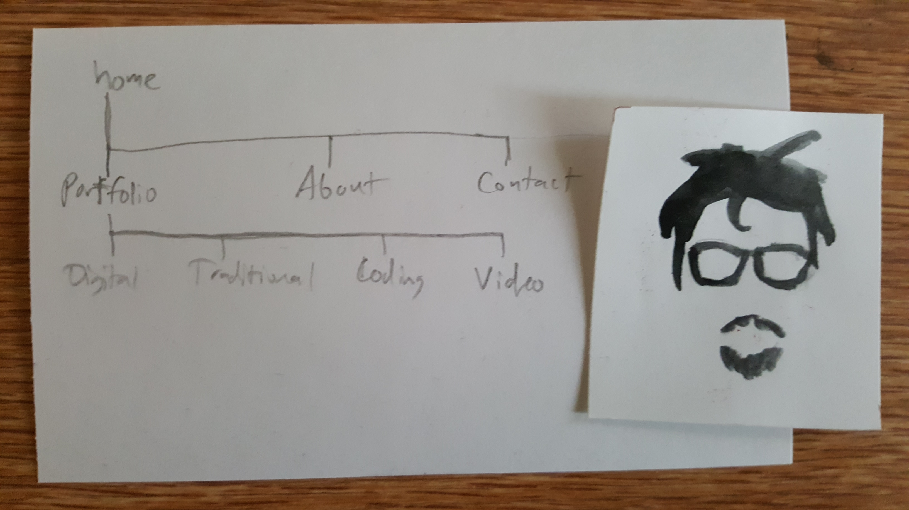

# Stephen Round
### MAR341 Final

---

For my final, I'm going to attempt to replicate from the ground up my [professional site](http://stephenrounddesign.com), which was something I joked about in week 11 but decided it would be an excellent challenge. The pro site was built with squarespace, which streamlined the entire process. I plan on adding web design to my repertoire of services, so being able to design entire sites without the use of site-building services will be beneficial for business.

 This is a basic layout for my site. A home button will lead to the front page, which will also be linked to my logo (the rough draft pictured to the right). I will also have a portfolio dropdown that contains all my categories of work. Next to that, an about page and a contact page.

Basically, if you want to see where the final product will end up, you can check the professional site. I'll try my best to end up with something very, very close. This will be akin to taking something crafted from an apprenticeship and attempting to recreate it like the master.
